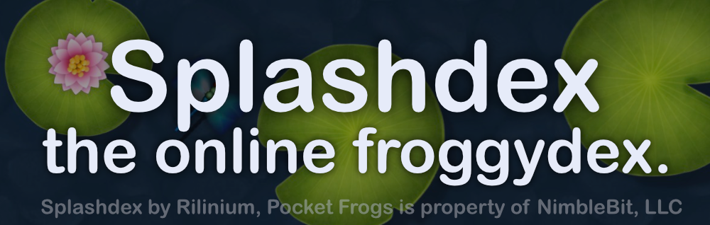

Pocket Frogs breed reference — 44,160 combinations, weekly sets, and frog builder. 

## Rendering pipeline
- **Layer order matters.** `renderFrog` always draws the grayscale `frog_base_256.png`, then the genus mask, then `overlay_256.png`. Each layer is retinted by drawing it into a tiny canvas, adjusting the pixel colors (base uses the `COLORS` table, genus uses `PATTERN_COLORS`) and painting that result into the preview canvas.
- **Overlay blending adds depth.** `_multiplyOverlay` implements a manual multiply-style blend that mixes the overlay sprite‘s luminance with whatever is underneath, so the frog keeps the shadows/shininess from the art. When the chosen color is `Glass` (color index 22) the routine also applies `_applyGlassEffect`, which cuts the alpha values by half to reproduce transparency.
- **Glitch-free fallback.** Sprite loading is asynchronous, but a placeholder ellipse is drawn whenever `loadSprite` rejects. That keeps the UI from freezing when files aren’t ready or the browser balks at the sprite cache.

## Sprite management and caching
- `loadSprite` keeps a promise cache so each `Image` only downloads once, and every sprite is fetched from `frog_sprites/` with `crossOrigin='anonymous'`. That promise is reused anywhere `renderFrog` needs the base, genus, or overlay textures, which was critical when dozens of species canvases try to draw simultaneously.

## Chroma discoveries
- Pattern 15 (`Chroma`) is special: it doesn’t just tint the genus mask with a fixed color; it updates every frame. `chromaCanvases` holds the canvas context plus the exposed RGB values and whether the current frog is glass, and `animateChroma` runs on `requestAnimationFrame` to sweep `chromaHue` through the HSV spectrum. That loop is also why `renderFrog` has to register the canvas in the map rather than drawing a single frame, the animation keeps running until the frog disappears from the DOM.

## Builder and browser behavior notes
- Species cards and weekly set tiles render lazily: each canvas starts with `_drawFrogPlaceholder`, and an `IntersectionObserver` paints the frog only when it scrolls into view (and clears it when it leaves). This keeps the browsers from decoding 120 canvas images upfront while the user is still scanning filters.
- Sets data is fetched from two sources (local `sets.txt` first, then `https://www.nimblebit.com/sets.txt` if needed), and the status element shows a friendly error when both fail. That double-fetch strategy came from noticing the GitHub Action snapshot already ships with a cached copy.

Hopefully these notes keep the rendering behavior transparent for anyone working in this folder. If you need a deeper dive, the relevant helpers live around the `renderFrog`, `_tintLayer`, and `animateChroma` functions inside `index.html`.
